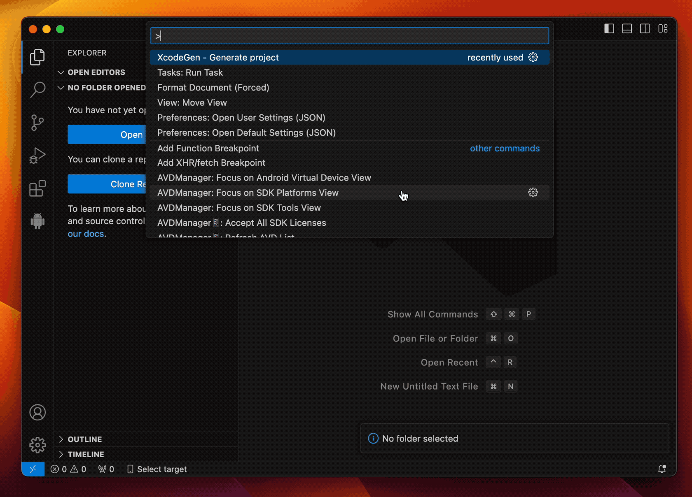

# XcodeGen Extension for Visual Studio Code

This Visual Studio Code extension simplifies the process of creating and managing iOS projects. It automates the generation of initial project files, the creation of an Xcode project using [XcodeGen](https://github.com/yonaskolb/XcodeGen), and the setup of debugging configurations for iOS development.

 

  

## Features

- **Create New iOS Projects**: Easily set up a new project with predefined `launch.json` and `project.yml` files.
- **Generate Xcode Project**: Use the `Generate xcodeproj` task to generate an Xcode project file (`xcodeproj`), necessary for building the application.
- **Launch and Debug iOS Applications**: Seamlessly debug your iOS application using Nisarg Jhaveri's [iOS Debug](https://github.com/nisargjhaveri/vscode-ios-debug) extension, which relies on the `Build using xcodebuild` task.

## Getting Started

### Creating a New Project

1. **Generate Project Files**: Use the `XcodeGen - Generate project` command to create a new project. You will be prompted to input the application name and bundle id prefix. The extension will generate the necessary `project.yml`, `launch.json` and `Application.swift` files to get started.

### Generating the Xcode Project

2. **Run the `Generate xcodeproj` Task**: Before building your application, you must generate the `.xcodeproj` file. Run the `Generate xcodeproj` task manually to accomplish this. Currently, this task needs to be triggered manually as chaining multiple `dependsOn` tasks is not supported.

### Debugging the Application

3. **Launch the iOS Application**: After generating the Xcode project, you can launch your iOS application. This process will automatically trigger the `Build using xcodebuild` task and attach the 'iOS Debug' extension for debugging.

## How It Works

### Creating Project Files

- The extension uses the provided app name and bundle ID prefix to generate a `project.yml` file, which `xcodegen` uses to create the Xcode project.
- It also sets up an initial `Application.swift` file with a basic SwiftUI structure.

### `launch.json` Configuration

- The generated `launch.json` includes the necessary configuration for launching and debugging the iOS application.
- The `preLaunchTask` is set to `Build using xcodebuild` to ensure that the Xcode project is up-to-date before debugging.

## Known Limitations

- The extension currently does not support chaining multiple `dependsOn` tasks, requiring manual intervention for the `Generate xcodeproj` task.
